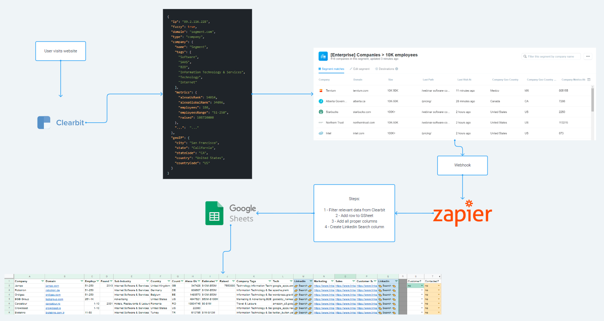

If you've done any growth or marketing-related job at a B2B SaaS company that relied on Inbound to generate leads, then you've probably asked yourself THE question. The million dollar question.

> How can I know which companies visit my website?

That was, until Clearbit Reveal. The first SaaS to match a website's visitors' IP address with a location, and thus a company HQ. Was Clearbit really the first? I have to admit I'm not sure, given how many actors are in this relatively new space already. Leadfeeder, Albacross, Leadberry... There are plenty.

Reveal was insane in and of itself, with the right developer at the heel, or with the right SaaS to help out, you can craft personalized experiences for your sites' visitors according to their Company's data. Imagine showing a completely different landing page to your Startup prospects than to your Enterprise ones. Just to name one of the most common examples.

But with the recent launch of Clearbit X, the data-sifting company really opened up their Reveal results to a whole new range of possibilities. Here's one I tried.

# From Website visit to LinkedIn contact

Before going into detail, here's how the whole process works:

1. Anonymous person visits our website
2. Clearbit Reveal matches IP with their Company's location + returns a bunch of data about this company
3. Company appears on Clearbit X along with pages visited
4. We create a Clearbit X segment with only interesting company profiles
5. We send every new company appearing in this Segment to a webhook
6. We digest this webhook, modify its data and send it to Google Sheets
7. We get a sheet with Company names, bunch of data, and 3 columns: link to search company prospects from the marketing team, sales team and customer success team

