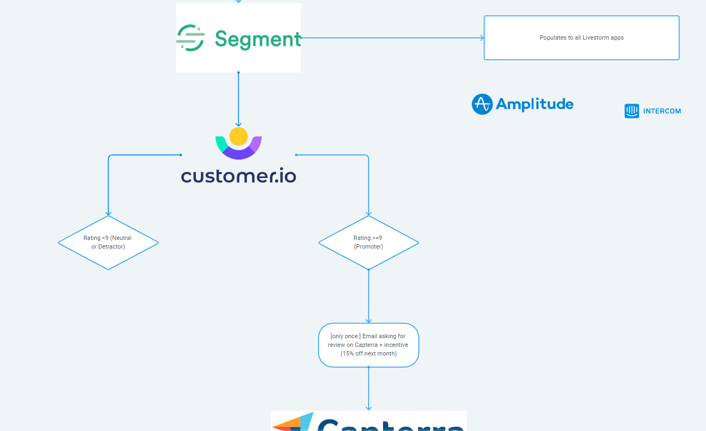

NPS has been widely adopted by most companies, including SaaS. It's a fairly simple and accurate way to measure customer satisfaction on a recurring basis. Not only that, but since it's widely used, it's also a good benchmark to compare your app to competitors' or inspiring companies in related spaces.

NPS measurement company Delighted has a good mini-website providing [NPS benchmarks by industry](https://delighted.com/nps-benchmarks).

When implementing NPS ratings (or any kind of customer satisfaction survey, be it in-app or via email or otherwise), the goal was to get a general sense of product. You poll users, plot the average rating over time, and see which way the rating goes.

This is already useful by itself, sure. But why stop there when you could actually associate the NPS with each customer? Thus keeping track of their latest rating to date and educating your future interactions in the process.

# NPS & Segment

Having started my SaaS Markter's career before Segment was a thing, you'll often see me rambling about how big of a difference its existence made.

